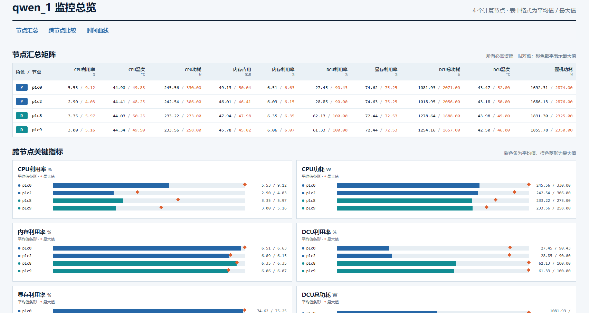
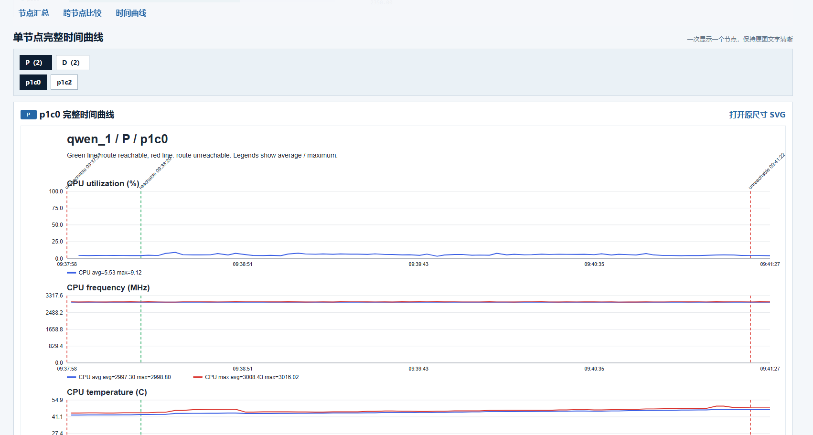

# Cluster Monitor

面向海光 DCU 超节点推理测试的轻量监控脚本。脚本运行在跳板机，通过 SSH 并行采集多个计算节点的数据，支持 **PD 分离**和 **IFB** 两种部署方式。

它会记录完整测试周期，在结束后根据 DCU 利用率识别稳态区间，并生成 CSV、稳态汇总表和单页 HTML 仪表盘。

## 能采集什么

- CPU：利用率、频率、温度、功耗
- 主机内存：占用量、总量、利用率
- 每张 DCU：利用率、显存、功耗、温度
- 计算节点：整机功耗
- InfiniBand：吞吐、包速率、链路状态和错误计数
- 服务端口：可访问/不可访问时间标记

每个计算节点可以单独查看，P、D、IFB 节点也会分类保存。

## 效果预览

全节点汇总与跨节点关键指标对比：



按 P、D、IFB 和节点切换的完整时间曲线：



> 截图用于展示页面布局；当前版本的汇总表和图例统一按自动识别出的稳态区间计算。

## 环境要求

跳板机需要：

- Python 3
- 可以免密 SSH 到所有计算节点

计算节点不需要 Python，只需要：

- Bash、`base64`
- `hy-smi`
- `ipmitool`
- 可读取的 `/proc` 和 `/sys`

## 快速开始

### 1. 修改配置

编辑 `monitor_config.jsonc`。PD 分离示例：

```jsonc
"deployment": {
  "mode": "PD",
  "groups": {
    "P": ["p1c0", "p1c1"],
    "D": ["p1c2", "p1c3"],
    "IFB": []
  }
}
```

IFB 示例：

```jsonc
"deployment": {
  "mode": "IFB",
  "groups": {
    "P": [],
    "D": [],
    "IFB": ["p1c0", "p1c1", "p1c2", "p1c3"]
  }
}
```

`mode: "PD"` 只使用 P、D 数组；`mode: "IFB"` 只使用 IFB 数组。

### 2. 设置服务端口标记（可选）

```jsonc
"route_probe": {
  "enabled": true,
  "host": "p1c0",
  "port": 8000,
  "interval_s": 1,
  "connect_timeout_s": 0.5,
  "successes_to_reachable": 1,
  "failures_to_unreachable": 3
}
```

端口状态只用于在 CSV 和曲线中标记服务启动、停止时间，不会控制数据采集，也不会改变统计区间。

### 3. 启动监控

```bash
python3 cluster_monitor.py --model DeepSeek-V3
```

脚本启动后立即记录。按 `Ctrl+C` 结束并生成汇总和可视化。

全部节点收到首包后，终端会打印一次节点检查；之后每约10秒打印采集健康度，例如：

```text
[节点检查] 所有节点首包正常 | P: p1c0(4卡), p1c2(4卡); D: p1c8(4卡), p1c9(4卡)
[状态] 已运行 20s | 节点采集 4/4正常（全部正常；P 2/2正常, D 2/2正常） | 集群DCU 28.5% | 检测到DCU负载，尚未进入统一稳态 | 路由端口 reachable
[稳态] 已进入统一稳态（起点 35.0s）
[稳态] 统一稳态已结束；全部节点DCU利用率≤2.0%，连续2/2个样本，可按 Ctrl+C
```

“节点采集正常”表示节点持续返回监控样本、识别到配置要求的DCU数量、采集命令没有报错，并且DCU利用率通道持续刷新。它只检查监控链路，不根据模型负载或DCU利用率高低判断节点是否正常。异常时会直接列出节点及原因，例如未收到首包、采样超时、DCU数量不符或利用率通道超时。

终端每约10秒同时显示统一稳态状态和全节点平均DCU利用率。进入统一稳态时打印一次提示；推理结束后，只要全部节点连续达到配置中的空闲阈值，就会提示可以手动按 `Ctrl+C`。即使本次负载始终没有满足统一稳态条件，只要曾经检测到DCU负载并随后全部归零，也会打印“未识别到统一稳态，但负载已经结束”。路由端口不参与这项判断。

也可以固定监控时长：

```bash
python3 cluster_monitor.py --model DeepSeek-V3 --duration 600
```

`--model` 会覆盖 JSONC 中的 `model_name`，并用于结果目录名称。`--duration 0` 表示一直运行到 `Ctrl+C`。

## 结果目录

```text
results/DeepSeek-V3_run_YYYYMMDD_HHMMSS/
├── dashboard.html              # 单页可视化入口
├── summary.csv                 # 统一稳态汇总，兼容旧版名称
├── shared_summary.csv          # 所有节点使用同一稳态区间
├── per_node_summary.csv        # 每个节点使用自己的稳态区间
├── full_summary.csv            # 完整生命周期汇总
├── steady_state.json           # 统一/每节点稳态结果与真实利用率样本
├── route_events.csv            # 端口状态事件
├── effective_config.json       # 本次实际配置
├── run_metadata.json
├── P/
│   └── p1c0/
│       ├── host.csv            # CPU、内存、整机数据
│       ├── dcu_cards.csv       # 四张DCU逐卡数据
│       ├── summary.csv         # 该节点统一稳态汇总，兼容旧版
│       ├── shared_summary.csv
│       ├── per_node_summary.csv
│       ├── full_summary.csv    # 该节点全程汇总
│       ├── visualization_full.svg # 无稳态判断的全程曲线
│       ├── visualization.svg   # 统一稳态区间曲线
│       └── visualization_per_node.svg
└── D/...
```

IFB 模式会生成 `IFB/` 目录。

仪表盘分为三部分：

1. 可在“无稳态判断”“统一稳态区间”和“每节点独立区间”之间切换的平均值/最大值汇总表，默认使用全程数据
2. 跨节点关键指标对比
3. 可切换节点及三种统计口径的完整时间曲线

## 查看结果

### 方式一：下载结果文件夹

用 SCP/SFTP 下载对应的**整个结果文件夹**，然后在本地打开 `dashboard.html`。

不能只下载 HTML，因为页面还需要同目录中的 SVG 文件。

### 方式二：通过 SSH 隧道直接查看

在本地终端执行下面的命令，并替换其中的大括号参数：

```powershell
ssh -tt -p {SSH_PORT} -L 18080:127.0.0.1:18080 {USER}@{JUMP_HOST} "cd {PROJECT_PATH}/results && exec python3 -m http.server 18080 --bind 127.0.0.1"
```

将 `{SSH_PORT}`、`{USER}`、`{JUMP_HOST}`、`{PROJECT_PATH}` 全部替换为当前环境的实际值。保持终端运行，然后浏览器访问：

```text
http://127.0.0.1:18080/
```

命令中的 `-tt` 会强制分配远端终端，`exec` 会让 Python 替换远端 shell。这样在 PowerShell 中按 `Ctrl+C` 时，中断信号会传给远端 HTTP 服务，同时关闭 SSH 隧道。服务只绑定服务器的 `127.0.0.1`，不会直接暴露结果目录。

### 关闭遗留的结果服务并重新连接

如果启动时出现 `OSError: [Errno 98] Address already in use`，说明跳板机上的 `127.0.0.1:18080` 已经有旧的 HTTP 服务。先查看占用进程：

```powershell
ssh -p {SSH_PORT} {USER}@{JUMP_HOST} "ss -ltnp | grep ':18080 '"
```

输出中会包含类似 `pid=12345` 的进程号。确认它是旧的 `python3 -m http.server 18080` 后，正常结束该 PID：

```powershell
ssh -p {SSH_PORT} {USER}@{JUMP_HOST} "kill {PID}"
```

再检查一次，命令没有输出就表示远端端口已释放：

```powershell
ssh -p {SSH_PORT} {USER}@{JUMP_HOST} "ss -ltnp | grep ':18080 ' || true"
```

随后重新启动结果服务并建立隧道：

```powershell
ssh -tt -p {SSH_PORT} -L 18080:127.0.0.1:18080 {USER}@{JUMP_HOST} "cd {PROJECT_PATH}/results && exec python3 -m http.server 18080 --bind 127.0.0.1"
```

保持 PowerShell 窗口运行，浏览器打开 `http://127.0.0.1:18080/`。本次使用完成后在该 PowerShell 窗口按 `Ctrl+C`，然后用上面的 `ss -ltnp` 命令确认 18080 已释放。若当前连接是用旧版无 `-tt` 命令建立的，需先按 PID 执行一次 `kill`；之后使用这里的新命令即可让 `Ctrl+C` 正常传递到远端。

如果确认远端已有的 18080 服务正是需要查看的结果目录，可以不重启服务，只重新建立隧道：

```powershell
ssh -p {SSH_PORT} -N -L 18080:127.0.0.1:18080 {USER}@{JUMP_HOST}
```

这种 `-N` 方式没有启动远端 HTTP 服务，所以 `Ctrl+C` 只关闭本地 SSH 隧道，远端已有服务会继续运行；需要关闭远端服务时仍要查出 PID 后执行 `kill PID`。

## 稳态判断与统计口径

- 程序始终计算统一稳态和每节点独立稳态，不再提供总开关；`steady_state` 中只保留检测算法参数。未检测到稳态时对应稳态页面为空，全程页面不受影响。
- 原始 `host.csv`、`dcu_cards.csv` 始终保留脚本开始到结束的全部数据。
- 统一口径：PD模式默认使用全部D节点，IFB模式默认使用全部IFB节点形成一条参考曲线，并把同一区间用于所有节点。
- 独立口径：每个节点使用自己的四卡平均DCU利用率单独判断，因此各节点的开始和结束时间可以不同。
- 判断只使用 `hy-smi --showhcuutil` 真正刷新的样本，不把中间复用的缓存值重复计数。
- 默认最近6个真实样本组成窗口，比较前后半段均值；连续2次变化不超过10%后确认稳态。
- 确认后向前回溯到第一个稳定样本，因此统计起点不是确认时刻。
- 连续2个真实样本低于2%后确认结束，再回溯到下降前最后一个稳定样本。
- 运行过程中，终端使用相同阈值在线显示统一稳态进度；另外检查所有节点是否都已连续回落到空闲阈值，以便提示何时可以手动按 `Ctrl+C`。在线提示只辅助操作，最终结果仍会在退出后用完整数据重新计算。
- HTML顶部提供“无稳态判断”“统一稳态区间”“每节点独立区间”三个按钮，默认选择“无稳态判断”。按钮会同时切换汇总表、跨节点比较和时间曲线，不需要修改JSONC或重新运行模型。
- “无稳态判断”直接使用脚本从启动到结束的全部有效样本；即使没有检测到稳态，默认汇总也不会为空。
- `summary.csv` 与 `shared_summary.csv` 使用统一口径；`per_node_summary.csv` 使用独立口径；`full_summary.csv` 保留完整生命周期统计。
- 原始CSV的 `phase`/`shared_phase` 标记统一口径，`node_phase` 标记该节点的独立口径，取值包括 `before_steady`、`steady`、`after_steady` 或 `not_detected`。
- 缺失值不会按 0 参与计算。
- 路由端口事件只做标记，不裁剪统计区间。
- DCU 利用率只采用 `hy-smi --showhcuutil` 的最近1秒 HCU active ratio。
- 节点 DCU 总功耗先在每个时刻汇总全部卡，再按稳态区间或完整生命周期分别计算平均值和最大值。

如果停止时模型仍在运行，稳态结束会标记为“未确认”，统计到脚本停止；如果没有检测到稳态，统一/独立稳态汇总仍保持为空，但默认的“无稳态判断”页面会正常展示全程统计。

## 常用配置

| 配置项 | 说明 |
|---|---|
| `model_name` | 默认模型名称，可被 `--model` 覆盖 |
| `monitor_duration_s` | `0` 表示运行到 Ctrl+C |
| `sample_interval_s` | CPU、内存等基础采样周期 |
| `dcu_utilization_interval_s` | DCU 利用率刷新周期 |
| `dcu_memory_interval_s` | 显存刷新周期 |
| `dcu_temperature_interval_s` | DCU 温度刷新周期 |
| `cpu_power_interval_s` | CPU 功耗刷新周期 |
| `node_power_interval_s` | 整机功耗刷新周期 |
| `ssh_options` | 跳板机连接计算节点的 SSH 参数 |
| `steady_state.window_fresh_samples` | 稳态窗口包含的真实利用率样本数 |
| `steady_state.confirm_windows` | 连续满足多少次后确认稳态 |
| `steady_state.idle_confirm_samples` | 连续多少个空闲样本后确认结束 |

较慢指标在独立周期刷新，中间样本复用最近一次成功值。`hy-smi --showhcuutil` 在部分环境中耗时约4秒，因此默认每5秒在独立 SSH 通道中运行，不阻塞基础采样。

## 常见问题

### 计算节点没有 Python

不影响使用。Python 只在跳板机运行，计算节点执行 Bash、`hy-smi`、`ipmitool` 和 sysfs 读取命令。

### 某个字段显示为空

表示采集命令没有返回该指标，或当前输出格式未被解析器识别。空值不代表 0。

### Ctrl+C 后能生成结果吗

可以。`Ctrl+C` 是正常结束方式，脚本会写出汇总、SVG 和 `dashboard.html`。

### 监控会明显影响推理吗

脚本使用持久 SSH，传输的是少量文本。显存、温度、BMC 功耗和较慢的 DCU 利用率命令使用较长刷新周期，通常不会形成大量网络流量。需要进一步降低干扰时，可以增大 JSONC 中的采样周期。

<details>
<summary><strong>采集命令与计算口径（排查时查看）</strong></summary>

### CPU与内存

```bash
cat /proc/stat
cat /proc/cpuinfo
cat /proc/meminfo
cat /proc/loadavg
```

- CPU利用率通过相邻两次 `/proc/stat` 累计计数差计算。
- `CPU利用率 = 100 × (1 - Δ(idle+iowait) / Δ全部CPU时间)`。
- `内存已用 = MemTotal - MemAvailable`。
- `内存利用率 = 内存已用 / MemTotal × 100%`。

CPU温度读取：

```bash
grep -H . /sys/class/hwmon/hwmon*/name /sys/class/hwmon/hwmon*/temp*_label /sys/class/hwmon/hwmon*/temp*_input 2>/dev/null
```

CPU功耗：

```bash
sudo ipmitool sensor get CPU_POWER | awk '/Sensor Reading/ {print $4; exit}'
```

整机功耗：

```bash
ipmitool dcmi power reading
```

### DCU

```bash
hy-smi --showuse --showmemuse --showpower --json
hy-smi --showhcuutil
hy-smi --showmeminfo vram --json
hy-smi --showtemp --json
```

- 利用率统一来自 `hy-smi --showhcuutil`。
- 单卡功耗来自 `Average Graphics Package Power (W)`。
- 显存利用率为 `已用显存 / 总显存 × 100%`。
- 温度保留 edge、junction、memory、core，汇总图默认使用 junction。

### InfiniBand

脚本读取：

```text
/sys/class/infiniband/*/ports/*/state
/sys/class/infiniband/*/ports/*/phys_state
/sys/class/infiniband/*/ports/*/rate
/sys/class/infiniband/*/ports/*/counters/*
```

包括发送/接收数据量、包数、接收错误、发送丢弃、符号错误、链路中断等计数器。吞吐通过相邻样本差值除以实际时间间隔计算。

### 路由端口

跳板机使用 Python `socket.create_connection()` 进行 TCP 建连探测。建连成功仅表示端口可以访问，不代表一次推理已经完成。

</details>
