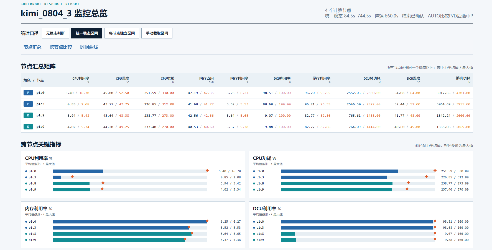
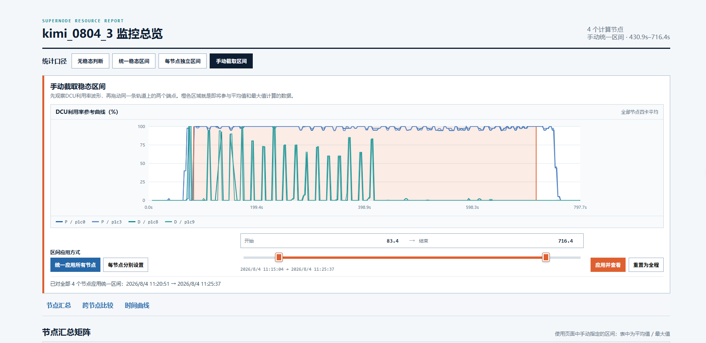

# Cluster Monitor

面向海光 DCU 超节点推理测试的轻量监控工具。脚本运行在跳板机，通过 SSH 并行采集多个计算节点，支持 **PD 分离**和 **IFB** 两种部署方式。

一次运行会保留从脚本启动到结束的全部原始数据，并在结束后生成：

- 按 P、D、IFB 和节点分类的 CSV
- 全程、统一稳态、每节点独立稳态三套统计结果
- 支持手动截取稳态区间的单页 HTML 仪表盘
- 平均值、最大值以及服务端口可达性标记

## 页面预览

自动稳态汇总：所有节点共用一个稳态区间，可直接比较各节点的平均值和最大值。



手动截取稳态：参考 DCU 利用率波形拖动起止位置，可统一应用到所有节点，也可逐节点设置。



节点时间曲线：按 P、D、IFB 和具体节点查看完整采样过程。


## 采集指标

| 对象 | 指标 |
|---|---|
| CPU | 利用率、平均频率、温度、功耗 |
| 主机内存 | 占用量、总量、利用率 |
| 每张 DCU | 利用率、显存占用、显存利用率、功耗、温度 |
| 计算节点 | 整机功耗 |
| InfiniBand | 发送/接收吞吐、包速率、链路状态、错误计数 |
| 服务端口 | reachable / unreachable 事件及时间戳 |

缺失值表示采集命令没有返回该指标或输出未被识别，不会按 `0` 参与统计。

## 环境要求

跳板机需要：

- Python 3
- 能够免密 SSH 到全部计算节点

计算节点不需要安装 Python，只需要：

- Bash、`base64`
- `hy-smi`
- `ipmitool`
- 可读取的 `/proc` 和 `/sys`

## 快速开始

### 1. 配置节点

编辑 `monitor_config.jsonc`。文件已按“部署、运行、稳态、端口、采样、命令、SSH”分区，并为每个参数提供注释。

PD 分离示例：

```jsonc
"deployment": {
  "mode": "PD",
  "groups": {
    "P": ["p1c0", "p1c1"],
    "D": ["p1c2", "p1c3"],
    "IFB": []
  }
}
```

IFB 示例：

```jsonc
"deployment": {
  "mode": "IFB",
  "groups": {
    "P": [],
    "D": [],
    "IFB": ["p1c0", "p1c1", "p1c2", "p1c3"]
  }
}
```

`mode: "PD"` 只使用 P、D 数组；`mode: "IFB"` 只使用 IFB 数组。

### 2. 配置服务端口标记（可选）

```jsonc
"route_probe": {
  "enabled": true,
  "host": "p1c0",
  "port": 8000,
  "interval_s": 1,
  "connect_timeout_s": 0.5,
  "successes_to_reachable": 1,
  "failures_to_unreachable": 3
}
```

端口状态只用于标记服务启动、停止时间，不控制采集，也不参与稳态判断。

### 3. 启动监控

```bash
python3 cluster_monitor.py --model DeepSeek-V3
```

`--model` 会覆盖 JSONC 中的 `model_name`，并用于结果目录名称。脚本启动后立即记录，按 `Ctrl+C` 正常结束并生成 CSV、SVG 和 HTML。

固定运行时长示例：

```bash
python3 cluster_monitor.py --model DeepSeek-V3 --duration 600
```

`--duration 0` 表示持续运行到手动按 `Ctrl+C`。

## 稳态与统计口径

原始数据始终记录脚本的完整生命周期，稳态识别只在统计和可视化阶段筛选区间，不会裁剪原始 CSV。

HTML 顶部提供四种口径：

1. **无稳态判断**：脚本启动到结束的全部有效样本，页面默认使用此口径。
2. **统一稳态区间**：所有节点共用自动检测出的一个区间。PD 模式默认分别分析 P、D，再选择质量更好的候选区间。
3. **每节点独立区间**：每个节点根据自己的四卡平均 DCU 利用率识别区间。
4. **手动截取区间**：在 DCU 利用率波形上手动选择起止时间，可统一应用或逐节点设置。

自动稳态主要依据 DCU 利用率：

- 最近若干个真实利用率样本构成窗口，对比前后半窗均值。
- 窗口平均利用率达到活跃阈值，且前后变化不超过阈值时，认为窗口稳定。
- 连续多个窗口稳定后确认进入稳态，并向前回溯到首个稳定样本。
- 利用率连续多个真实样本低于空闲阈值后确认结束，并排除下降过程。
- 程序只使用 `hy-smi --showhcuutil` 真正刷新的样本，不把复用的缓存值重复用于判稳。

具体阈值都集中在 `monitor_config.jsonc` 的 `steady_state` 区域。自动检测不到稳态时，全程数据仍正常展示。

### 手动截取方法

打开 `dashboard.html` 并点击“手动截取区间”：

1. 选择“统一应用所有节点”或“每节点分别设置”。
2. 参考控制区中的 DCU 利用率曲线，拖动同一条轨道上的开始、结束手柄。
3. 也可以在组合输入框中直接填写相对脚本启动时间的秒数。
4. 点击“应用并查看”，汇总矩阵、跨节点比较和下方动态时间曲线会同步更新；曲线下方的平均值、最大值也按新选区重新计算。

手动统计在浏览器中使用 HTML 内嵌的原始采样数据即时计算，只改变当前页面显示，不修改服务器上的 CSV 或自动稳态结果。

## 运行状态怎么看

全部节点收到首包后，终端会打印一次节点检查，之后约每 10 秒输出采集健康度和稳态进度：

```text
[节点检查] 所有节点首包正常 | P: p1c0(4卡), p1c2(4卡); D: p1c8(4卡), p1c9(4卡)
[状态] 已运行 20s | 节点采集 4/4正常（全部正常；P 2/2正常, D 2/2正常） | 集群DCU 28.5% | 检测到DCU负载，尚未进入统一稳态 | 路由端口 reachable
[稳态] 已进入统一稳态（起点 35.0s）
[稳态] 统一稳态已结束；全部节点DCU利用率≤2.0%，连续2/2个样本，可按 Ctrl+C
```

“节点采集正常”表示节点持续返回样本、DCU 数量符合预期、采集命令未报错且利用率通道持续刷新。它用于检查监控链路，不代表模型负载一定正常。

## 结果目录

```text
results/DeepSeek-V3_run_YYYYMMDD_HHMMSS/
├── dashboard.html              # 单页可视化入口
├── full_summary.csv            # 完整生命周期汇总
├── shared_summary.csv          # 统一稳态汇总
├── per_node_summary.csv        # 每节点独立稳态汇总
├── summary.csv                 # 统一稳态汇总的兼容名称
├── steady_state.json           # 稳态区间、候选组和利用率样本
├── route_events.csv            # 服务端口状态事件
├── effective_config.json       # 本次运行的实际配置
├── run_metadata.json
├── P/
│   └── p1c0/
│       ├── host.csv            # CPU、内存、整机功耗
│       ├── dcu_cards.csv       # 四张 DCU 的逐卡数据
│       ├── full_summary.csv
│       ├── shared_summary.csv
│       ├── per_node_summary.csv
│       └── visualization*.svg
└── D/...
```

IFB 模式会生成 `IFB/` 目录。所有 CSV 均包含时间戳；汇总表中的平均值和最大值按对应统计口径计算。

## 查看结果

### 方式一：下载结果文件夹

通过 SCP/SFTP 下载对应的**整个结果文件夹**，然后在本地打开 `dashboard.html`。不要只下载 HTML，因为页面还会加载同目录下各节点的 SVG。

### 方式二：通过 SSH 隧道在服务器上查看

以下是一个使用虚拟 IP、端口和 root 用户的完整示例：

```powershell
ssh -tt -p 2222 -L 18080:127.0.0.1:18080 root@192.0.2.10 "cd /root/dcu_monitor/results && exec python3 -m http.server 18080 --bind 127.0.0.1"
```

保持该终端运行，在本地浏览器打开：

```text
http://127.0.0.1:18080/
```

通用命令模板：

```powershell
ssh -tt -p {SSH_PORT} -L 18080:127.0.0.1:18080 {USER}@{JUMP_HOST} "cd {PROJECT_PATH}/results && exec python3 -m http.server 18080 --bind 127.0.0.1"
```

`-tt` 和 `exec` 可以让本地 `Ctrl+C` 同时结束远端 HTTP 服务与 SSH 隧道。HTTP 服务只绑定远端 `127.0.0.1`，不会直接暴露结果目录。

如果提示 `Address already in use`，先确认占用 18080 的进程：

```powershell
ssh -p {SSH_PORT} {USER}@{JUMP_HOST} "ss -ltnp | grep ':18080 '"
```

确认是遗留的 `python3 -m http.server 18080` 后，再执行 `kill {PID}`，然后重新建立隧道。

## 常用配置

| 配置项 | 作用 |
|---|---|
| `model_name` | 默认模型名，可被 `--model` 覆盖 |
| `deployment.mode` | `PD` 或 `IFB` |
| `deployment.groups` | P、D、IFB 节点列表 |
| `expected_dcu_cards_per_node` | 每个节点预期 DCU 数量 |
| `monitor_duration_s` | `0` 表示运行到 `Ctrl+C` |
| `sample_interval_s` | 基础指标采样周期 |
| `dcu_utilization_interval_s` | DCU 利用率真实刷新周期 |
| `steady_state.reference_group` | PD 下可用 `auto`、`P` 或 `D` |
| `steady_state.window_fresh_samples` | 稳态窗口的真实样本数 |
| `steady_state.confirm_windows` | 连续多少个窗口后确认开始 |
| `steady_state.idle_confirm_samples` | 连续多少个空闲样本后确认结束 |
| `route_probe` | 服务端口标记参数 |
| `ssh_options` | 跳板机连接计算节点的 SSH 参数 |

建议优先修改 JSONC 顶部的节点、模型、端口和采样周期；采集命令只有在机器输出格式不同时才需要调整。

<details>
<summary><strong>采集命令与计算口径</strong></summary>

### CPU 与内存

```bash
cat /proc/stat
cat /proc/cpuinfo
cat /proc/meminfo
cat /proc/loadavg
grep -H . /sys/class/hwmon/hwmon*/name /sys/class/hwmon/hwmon*/temp*_label /sys/class/hwmon/hwmon*/temp*_input 2>/dev/null
sudo ipmitool sensor get CPU_POWER | awk '/Sensor Reading/ {print $4; exit}'
```

- CPU 利用率通过相邻两次 `/proc/stat` 累计计数差计算。
- `CPU利用率 = 100 × (1 - Δ(idle+iowait) / Δ全部CPU时间)`。
- `内存已用 = MemTotal - MemAvailable`。
- `内存利用率 = 内存已用 / MemTotal × 100%`。

### DCU

```bash
hy-smi --showuse --showmemuse --showpower --json
hy-smi --showhcuutil
hy-smi --showmeminfo vram --json
hy-smi --showtemp --json
```

- `hy-smi --showuse` 返回查询时刻的瞬时 CU 使用率，短脉冲负载可能恰好采到空闲值。
- DCU 利用率统一使用 `hy-smi --showhcuutil` 的最近 1 秒 HCU active ratio：默认在 1 秒窗口内周期采样 DCU 是否活跃，以活跃采样次数占比表示利用率，更适合推理监控和稳态识别。接口语义可参考海光官方 [HYGON-AI/dcu-dcgm](https://pkg.go.dev/github.com/HYGON-AI/dcu-dcgm/v2/pkg/dcgm#DCUSampledUsage)。
- 单卡功耗来自 `Average Graphics Package Power (W)`。
- 显存利用率为 `已用显存 / 总显存 × 100%`。
- 温度保留 edge、junction、memory、core，汇总默认使用 junction。

### 整机功耗

```bash
ipmitool dcmi power reading
```

### InfiniBand

```text
/sys/class/infiniband/*/ports/*/state
/sys/class/infiniband/*/ports/*/phys_state
/sys/class/infiniband/*/ports/*/rate
/sys/class/infiniband/*/ports/*/counters/*
```

吞吐和包速率通过相邻样本计数器差除以实际时间间隔计算。

### 服务端口

跳板机使用 Python `socket.create_connection()` 进行 TCP 建连探测。建连成功只表示端口可访问，不表示一次推理已经完成。

</details>

## 常见问题

**计算节点没有 Python，能运行吗？**  可以。Python 只运行在跳板机，计算节点执行 Bash、`hy-smi`、`ipmitool` 和 sysfs 读取命令。

**按 Ctrl+C 会丢失结果吗？**  不会。`Ctrl+C` 是正常结束方式，脚本会继续生成汇总、SVG 和 `dashboard.html`。

**监控会明显影响模型性能吗？**  脚本使用持久 SSH，只传输少量文本。较慢命令有独立刷新周期；如需进一步降低干扰，可以适当增大 JSONC 中的采样间隔。
